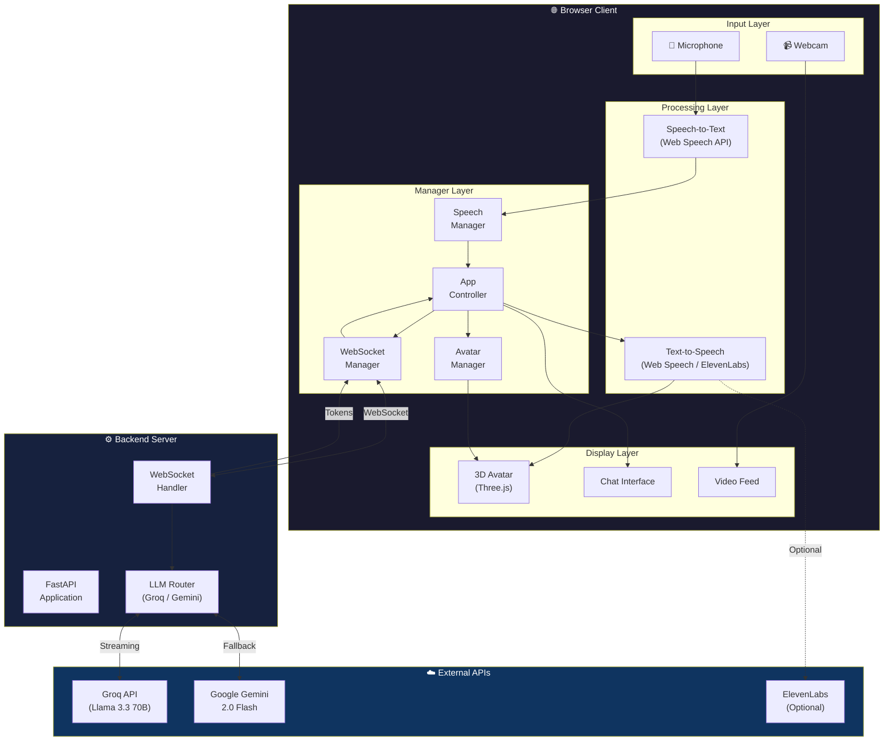
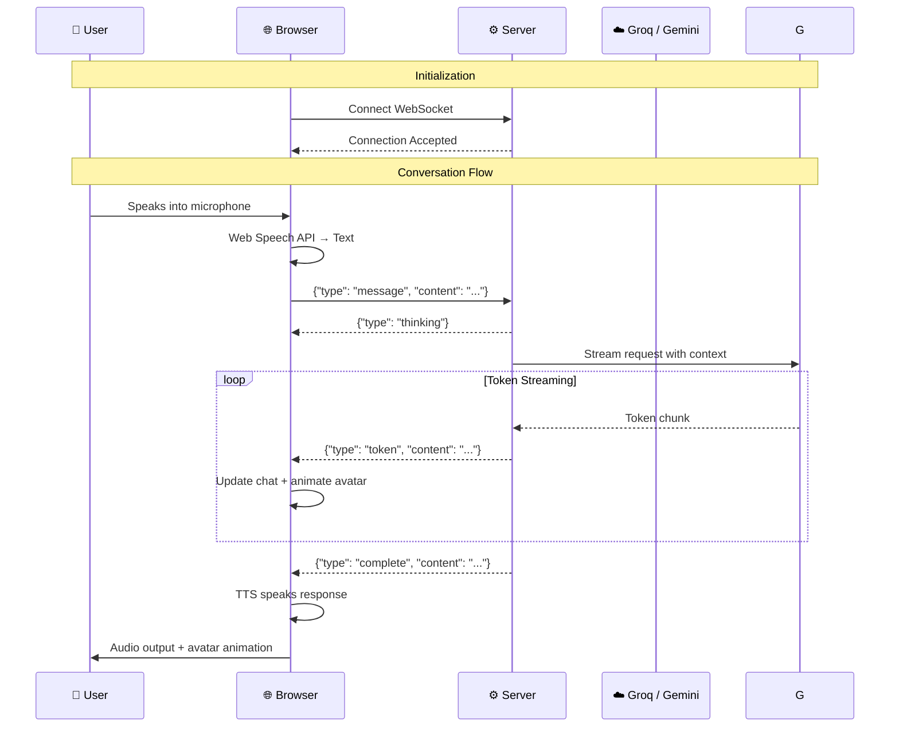
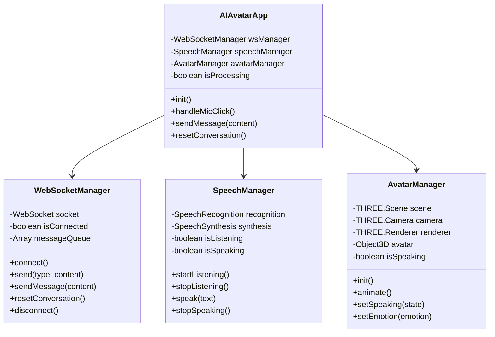
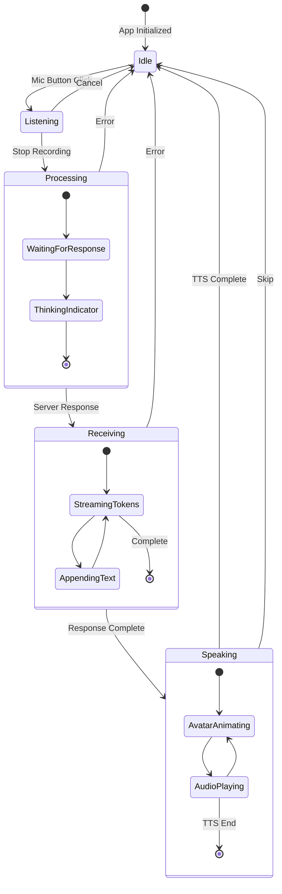
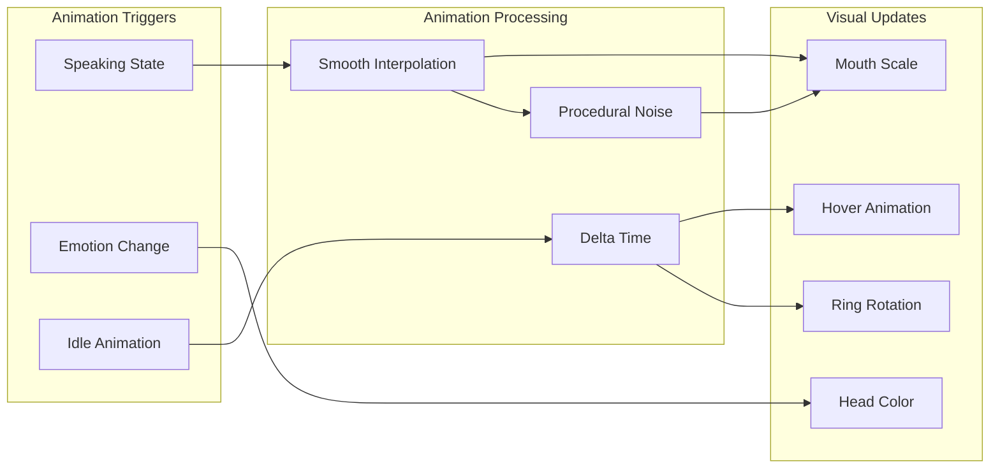
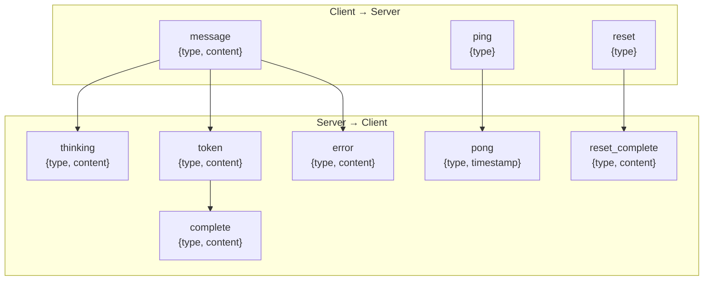
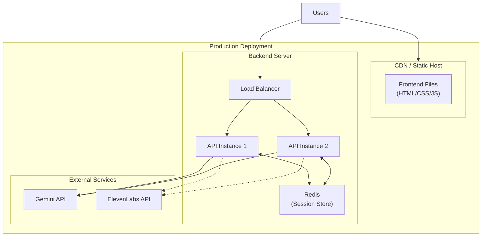

# Architecture Documentation

## AI Avatar & Reality Interaction System

This document provides visual diagrams of the system architecture.

---

## System Overview



---

## Data Flow Sequence



---

## Component Architecture



---

## State Machine



---

## Avatar Animation System



---

## Network Protocol

### WebSocket Message Types



---

## File Structure

```
ai-avatar/
├── backend/
│   ├── main.py                 # FastAPI server
│   │   ├── /                   # Root endpoint (health)
│   │   ├── /api/health         # Detailed health check
│   │   ├── /api/configure      # Runtime API config
│   │   ├── /api/conversation   # Get/clear history
│   │   └── /ws/chat            # WebSocket endpoint
│   ├── requirements.txt        # Python dependencies
│   └── .env                    # Environment variables
│
├── frontend/
│   ├── index.html              # Main HTML
│   ├── css/
│   │   └── styles.css          # Glassmorphism design
│   └── js/
│       ├── app.js              # Main controller
│       ├── websocket.js        # WebSocket handling
│       ├── speech.js           # STT/TTS
│       └── avatar.js           # Three.js avatar
│
├── README.md                   # User documentation
├── TECHNICAL.md                # Technical documentation
└── architecture.md             # This file
```

---

## Deployment Architecture



---

*This architecture is designed for scalability and can handle thousands of concurrent users with appropriate infrastructure.*
